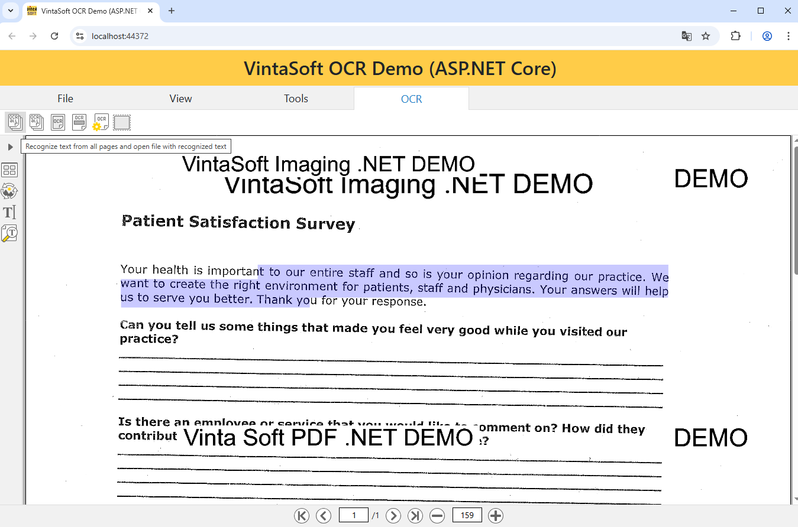

# VintaSoft ASP.NET Core OCR Demo

This ASP.NET Core project uses <a href="https://www.vintasoft.com/vsimaging-dotnet-index.html">VintaSoft Imaging .NET SDK</a>.
The client-side of project uses HTML+JavaScript+CSS. The server-side of project uses ASP.NET Core API controllers.<br />
<br />
The project demonstrates how to recognize text in image in ASP.NET Core:
* Load images from file.
* Process images before OCR (invert, rotate, binarize, remove noise).
* Segment image before OCR.
* Set OCR settings (select language from about more than 100 available languages, binarization mode, etc). 
* Recognize text on the whole image or in region of interest.
* Save OCR results as text file.
* Save OCR results as searchable PDF document.
* The application can be used in any modern HTML5 web browser.
* The application UI is localized into 45 languages (Afrikaans, Arabic, Armenian, Azerbaijan, Belarusian, Bulgarian, Chinese, Croatian, Czech, Danish, Dutch, English, Estonian, Finnish, French, Georgian, German, Greece, Hebrew, Hindi, Hungarian, Italian, Japanese, Kazakh, Korean, Kyrgyz, Latvian, Lithuanian, Norwegian, Portugese, Romanian, Russian, Slovakian, Slovenian, Spanish, Swahili, Swedish, Tajik, Tatar, Turkish, Turkmen, Ukrainian, Uzbek, Vietnamese, Zulu).


## Screenshot
<br />


## Usage
1. Get the 30 day free evaluation license for <a href="https://www.vintasoft.com/vsimaging-dotnet-index.html" target="_blank">VintaSoft Imaging .NET SDK</a> as described here: <a href="https://www.vintasoft.com/docs/vsimaging-dotnet/Licensing-Evaluation.html" target="_blank">https://www.vintasoft.com/docs/vsimaging-dotnet/Licensing-Evaluation.html</a>

2. Update the evaluation license in "src\Startup.cs" file:
   ```
   Vintasoft.Imaging.ImagingGlobalSettings.Register("REG_USER", "REG_EMAIL", "EXPIRATION_DATE", "REG_CODE");
   ```

3. Build the project ("AspNetCoreOcrDemo.Net10.csproj" file) in Visual Studio or using .NET CLI:
   ```
   dotnet build AspNetCoreOcrDemo.Net10.csproj
   ```

4. Run compiled application and try to recognize text in image.


## Documentation
VintaSoft Imaging .NET SDK on-line User Guide and API Reference for Web developer is available here: https://www.vintasoft.com/docs/vsimaging-dotnet-web/


## Support
Please visit our <a href="https://myaccount.vintasoft.com/">online support center</a> if you have any question or problem.
